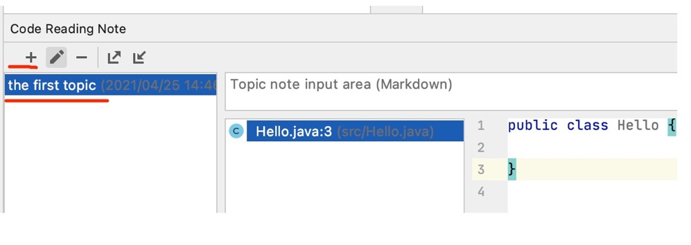
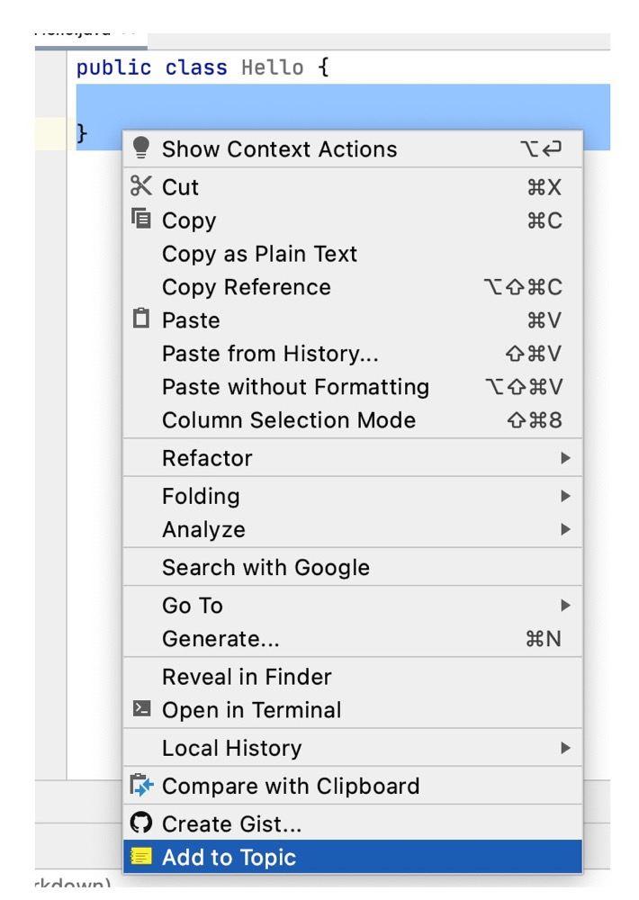
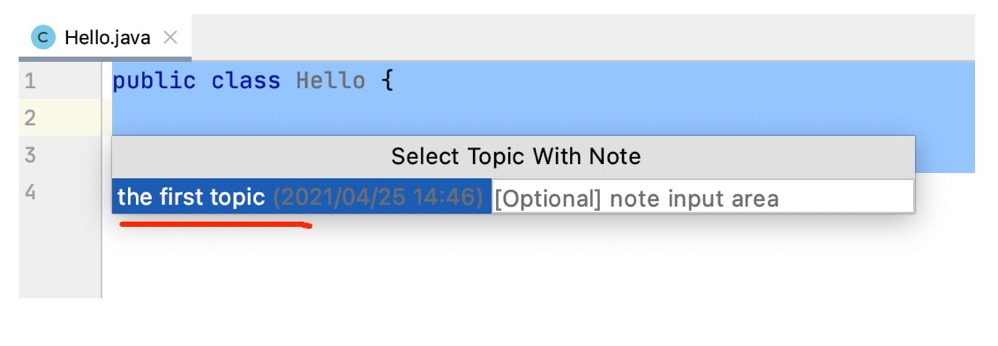
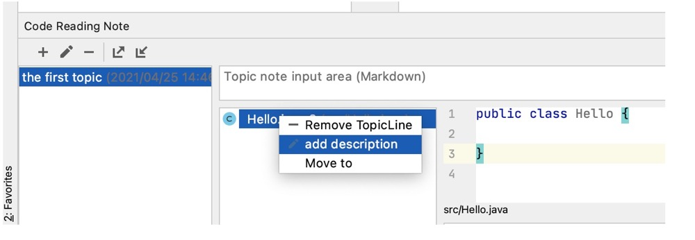
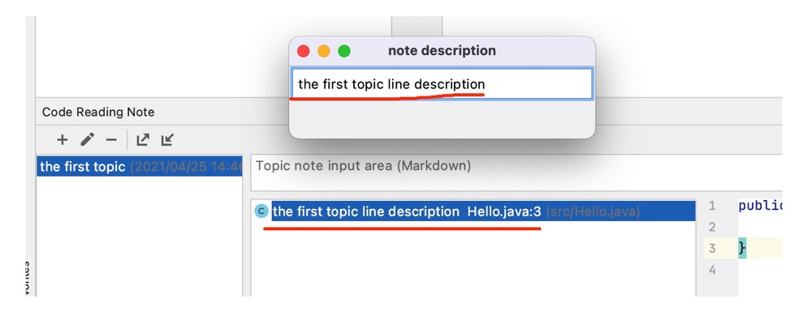

# CodeReadingNote
This is a  idea note plugin  for specific line of the file, you can use it to add folder for what you  use recently or frequently.  This plugin is  an optimization for the origin "CodeReadingNote" (https://github.com/kitabatake/CodeReadingNote). Thank for kitabatake's good job.

## usage 

### 1. add a topic  

Add a new topic for what you are dealing with

  

### 2. add line shortcut for target file and line 

Select the code and  add it to your topic.

  

  

### 3. add description for line shortcut

This is a optimization for the origin plugin "code reading note", you can add brief description for each line shortcut. So you can see what a line shortcut is without clicking and opening it, that means what you see is what you want, you quickly find what you are looking for  with a single glance .

  

  

